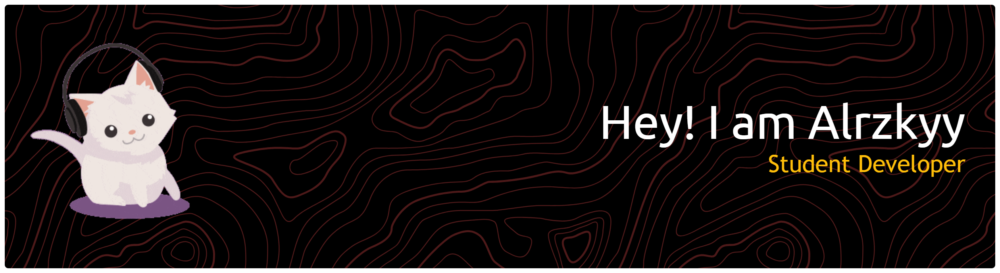

<!-- ═══════════════════════════════════════════════════════════ -->
<!--  BANNER & GIF                                               -->
<!-- ═══════════════════════════════════════════════════════════ -->

<div align="center">
  
  
</div>

<br/>

<!-- ═══════════════════════════════════════════════════════════ -->
<!--                     TYPING ANIMATION                        -->
<!-- ═══════════════════════════════════════════════════════════ -->

<div align="center">

<div align="center">
  
</div>

<br/><br/>

<a href="https://github.com/alrzkyy">
  
</a>
&nbsp;
<a href="https://github.com/alrzkyy?tab=followers">
  
</a>

</div>

<br/>

---

## 👤 About Me

I am **alrzkyy**, a passionate Student Developer from Indonesia who is deeply invested in exploring the world of web development, from crafting beautiful frontends to building robust backends. I'm constantly learning, and every day I discover more reasons why coding is so incredibly fun.

What truly drives me? The absolute thrill of writing code in my editor and seeing it come to life in the browser. There is simply no feeling quite like it.

```js
const alrzkyy = {
  name: "alrzkyy",
  role: "Student Developer 🎓",
  location: "Indonesia 🇮🇩",
  currently: "Exploring Full-Stack & building cool projects",
  passions: ["Clean UI/UX", "Readable Code", "Late-night Coffee ☕"],
  openFor: "Collaborations, open-source, or connecting with fellow devs",
  funFact: "Still debugging with console.log() and proud of it! 😅",
};
```

<br/>

---


###


###

<div align="left">
  
  
  
  
  
  
  
  
  
  
  
  
  
  
  
  
  
  
  
  
  
  
  
  
  
  
  
  
  
  
  
  
  
  
  
  
  
  
  
  
  
  
  
  
  
</div>

###

<div align="left">
  <a href="https://www.instagram.com/alrzkyy11_" target="_blank">
    
  </a>
  <a href="https://discord.com/channels/@alrzkyy1_" target="_blank">
    
  </a>
  <a href="alrzkyy11@gmail.com" target="_blank">
    
  </a>
  <a href="https://x.com/alrzkyy1_" target="_blank">
    
  </a>
  <a href="https://web.telegram.org/alkermann" target="_blank">
    
  </a>
</div>

###

<p align="center">
  
</p>

###


###

<div align="center">
  
  
</div>

###
