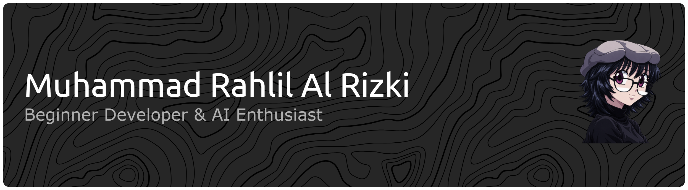

<!-- Banner -->
<div align="center">
  
  <br />
  
</div>

<br />

<div align="center">
  
</div>

---

## About Me

Hello, my name is **Muhammad Rahlil Al Rizki**. I am a **student developer from Purwakarta, Indonesia**. I am an AI enthusiast and I also enjoy exploring and building **AI-powered software and programming projects**.

I enjoy learning by building real projects, experimenting with new technologies, and continuously improving the way I design and develop software.

```js
const alrzkyy = {
  role: "Student Developer",
  location: "Purwakarta, Indonesia 🇮🇩",
  interests: ["AI", "AI-powered Development", "Web Apps", "Mobile Apps", "Automation"],
  currentProjects: ["VeloFlix", "AstraVerse", "AstraChat"]
};
```

<br />


### Tech Stack I Use & Am Currently Learning

<div align="left">
  
  
  
  
  
  
  
  
  
  
  
  
  
  
  
  
  
  
  
  
  
  
  
  <br /><br />
  
  
  
  
  
  
  
  
  
  
  
  
  
  
  
  
  
  
  
  
  
</div>

<br clear="both" />

---

<div align="center">

## Featured Projects

A few projects I've spent the most time building and shipping.

</div>

<table>
<tr>
<td width="50%" valign="top">

### 🎬 VeloFlix

Movie and series streaming platform with authentication, realtime features, notifications, and automated content workflows.

<p>
  
  
  
  
</p>

<a href="https://veloflix.my.id"></a>


</td>
<td width="50%" valign="top">

### 🪐 AstraVerse

Anime, donghua, and comic platform focused on fast browsing and automated content workflows.

<p>
  
  
  
  
</p>

<a href="https://astraverse.web.id"></a>


</td>
</tr>
<tr>
<td width="50%" valign="top">

### 🌌 AstraChat

Realtime messaging app with direct and group chat, media sharing, WebRTC calls, and client-side encryption.

<p>
  
  
  
  
</p>

<a href="https://github.com/alrzkyy/AstraChat"></a>

</td>
<td width="50%" valign="top">

### 💰 FInSight

Personal finance app for tracking spending, reviewing trends, and experimenting with useful AI-assisted features.

<p>
  
  
  
  
</p>

<a href="https://github.com/alrzkyy/finsightapp"></a>

</td>
</tr>
</table>

<div align="center">
  <sub>Private source means the project is public to use, but the repository itself is not.</sub>
</div>

---

## Find Me

<div align="left">
  <a href="https://www.instagram.com/alrzkyy11_" target="_blank">
    
  </a>
  <a href="https://x.com/alrzkyy1_" target="_blank">
    
  </a>
  <a href="https://t.me/alkermann_" target="_blank">
    
  </a>
</div>

---

<div align="center">
  
</div>

### Contribution Snake

<div align="center">
  
</div>

<div align="center">
  <sub>Still building. Still learning.</sub>
</div>
